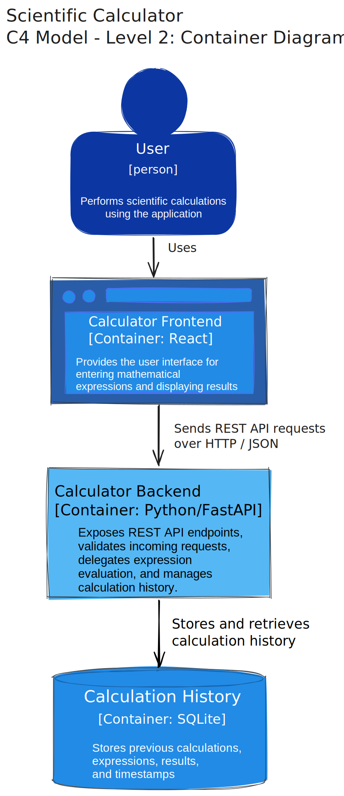
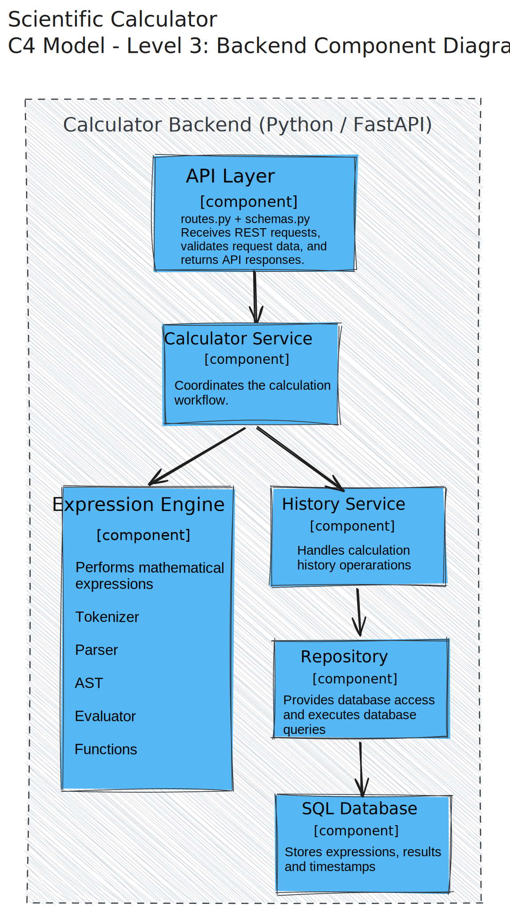
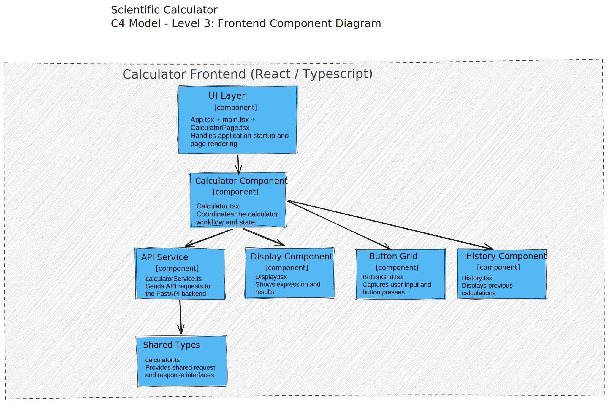

# Scientific Calculator Architecture

This document describes the architecture of the Scientific Calculator application.

The project follows the C4 Model to document the system from different levels of abstraction. Each diagram focuses on a specific aspect of the architecture, starting with the overall system context and gradually introducing the internal structure of the application.

The purpose of this document is to explain how the system is organized, how its main parts interact, and why key architectural decisions were made.

## 1. System Context Diagram

### Purpose

The System Context Diagram provides a high-level overview of the Scientific Calculator application. It shows the system boundary and the external actors that interact with the application, without going into implementation details.

### Description

The Scientific Calculator is used by a single external actor: the user. The user interacts with the application to perform scientific calculations and view previous calculation results.

At this stage, the application does not communicate with any external software systems or third-party services. The diagram therefore focuses only on the relationship between the user and the application itself.

## 2. Container Diagram

### Purpose

The Container Diagram presents the high-level internal structure of the Scientific Calculator application. It identifies the major executable parts of the system, their responsibilities, and the communication between them.

### Description

The application consists of three containers:

- **Calculator Frontend (React)** provides the graphical user interface that allows users to enter mathematical expressions and view calculation results.
- **Calculator Backend (Python / FastAPI)** exposes the REST API used by the frontend, validates incoming requests, coordinates expression evaluation, and manages calculation history.
- **Calculation History (SQLite)** stores previously evaluated expressions together with their results and timestamps.

The user interacts exclusively with the frontend. Communication between the frontend and backend takes place through a REST API using HTTP and JSON. The backend is responsible for persisting and retrieving calculation history from the SQLite database.

## 3. Backend Component Diagram

### Purpose

This diagram shows how the backend is structured internally and how its main components work together to process calculations and manage calculation history.

### Description

The backend is split into several components, each responsible for a specific part of the application.

- **API Layer** receives requests from the frontend, validates the incoming data, and returns responses.
- **Calculator Service** coordinates the calculation process by calling the required backend components.
- **Expression Engine** evaluates mathematical expressions. It consists of the tokenizer, parser, AST, evaluator, and the implementations of supported mathematical functions.
- **History Service** handles saving and retrieving calculation history.
- **Repository** is responsible for communicating with the database and executing database queries.
- **SQLite Database** stores calculation expressions, results, and timestamps.

When the frontend sends a calculation request, it first reaches the API layer. The request is then passed to the Calculator Service, which uses the Expression Engine to evaluate the expression. If the calculation should be stored in the history, the Calculator Service calls the History Service. The History Service uses the Repository to save or retrieve data from the SQLite database.

## 4. Frontend Component Diagram

### Purpose

This diagram shows how the frontend is structured internally and how its main components work together to provide the user interface and communicate with the backend.

### Description

The frontend is divided into several components, each with a specific responsibility.

- **UI Layer** is responsible for starting the React application and rendering the calculator page. It consists of `main.tsx`, `App.tsx`, and `CalculatorPage.tsx`.
- **Calculator Component** coordinates the calculator workflow and manages the application's state. It connects the user interface with the backend communication.
- **Display Component** shows the current mathematical expression and the calculation result.
- **Button Grid** captures user input by handling button presses and passing them to the Calculator Component.
- **History Component** displays previously completed calculations.
- **API Service** is responsible for communicating with the backend by sending HTTP requests and receiving responses.
- **Shared Types** contains the shared TypeScript interfaces used throughout the frontend, such as the request and response models exchanged with the backend.

When the application starts, the UI Layer renders the Calculator Component. The Calculator Component coordinates the interaction between the other frontend components. User input is received through the Button Grid, while the Display Component presents the current expression and calculation result. When a calculation needs to be performed, the Calculator Component uses the API Service to send a request to the backend. After receiving the result, it updates the Display Component and, if necessary, the History Component. The API Service uses the shared TypeScript interfaces defined in Shared Types to ensure that requests and responses follow a consistent structure.