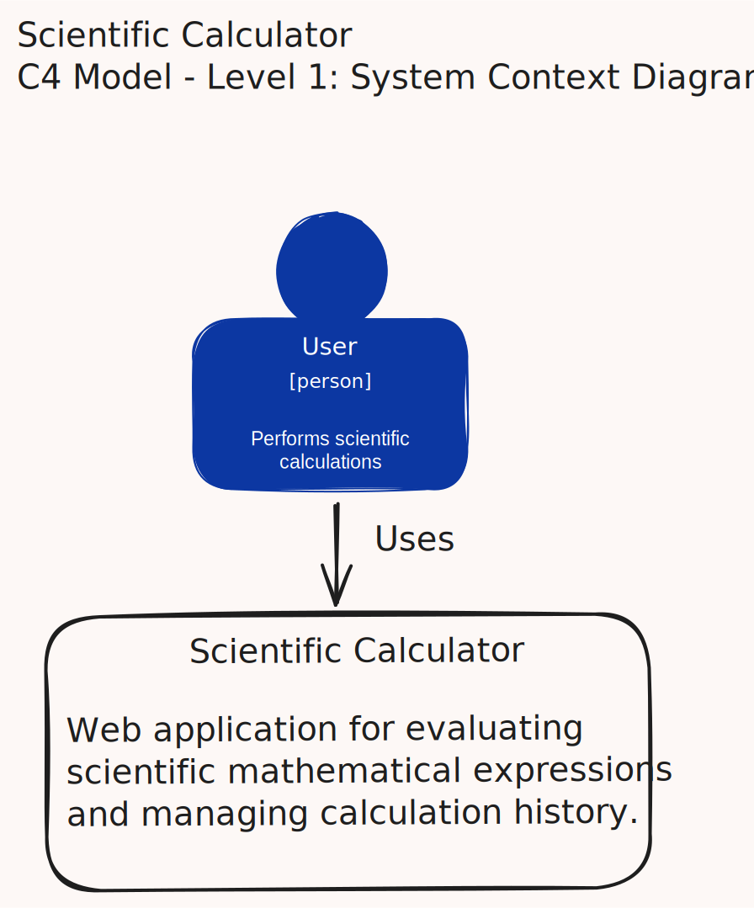

# Scientific Calculator Architecture

This document describes the architecture of the Scientific Calculator application.

The project follows the C4 Model to document the system from different levels of abstraction. Each diagram focuses on a specific aspect of the architecture, starting with the overall system context and gradually introducing the internal structure of the application.

The purpose of this document is to explain how the system is organized, how its main parts interact, and why key architectural decisions were made.

## 1. System Context Diagram

